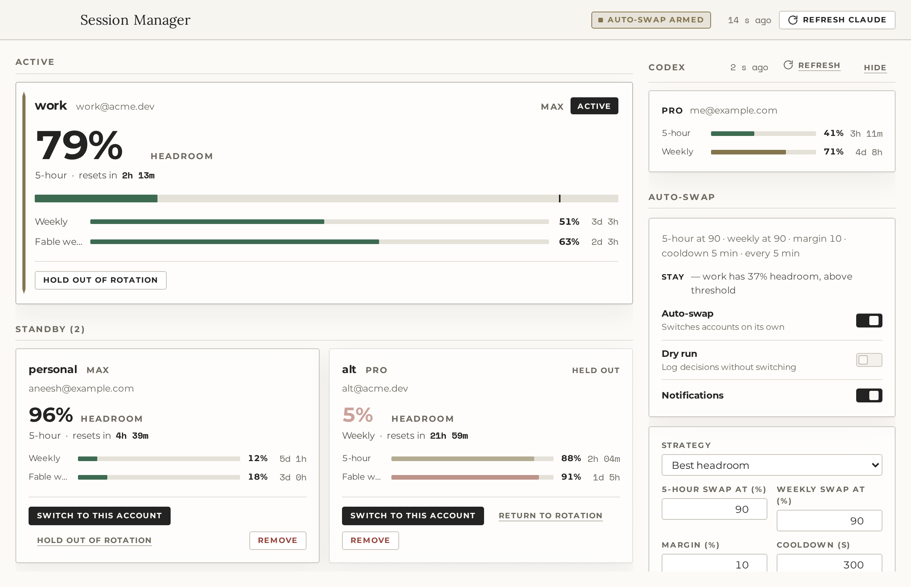

# Session Manager

[](https://github.com/aneesh-iyer29/session-manager/actions/workflows/ci.yml)
[](https://github.com/aneesh-iyer29/session-manager/releases/latest)
[](LICENSE)

A macOS menu bar app for people who run several Claude Code accounts. It watches the
usage limits of every account, shows how much runway each one has left, and swaps the
active login before the 5-hour session (or the weekly / Fable weekly window) throttles you.
One Codex account's quota is shown alongside, read-only.

- **Many Claude accounts, one dashboard.** Capture the account Claude Code is logged in
  with, or add more through a browser login. Each account gets a gauge showing its
  headroom and when its binding window resets.
- **Session-first auto-swap.** When the active account's 5-hour session reaches its swap
  line, or its weekly or Fable weekly window reaches theirs, the app switches Claude Code to
  the account with the most headroom on the axis that ran out. Cooldown, margin, and a
  dry-run mode keep it from flapping.
- **One Codex account, read-only.** If the Codex CLI is logged in with ChatGPT, its 5-hour
  and weekly windows appear in the sidebar.
- **Menu bar first.** The tray item is a glance menu: a usage bar per window for every
  account, plus Open and Quit. Switching and settings live in the window, so the menu can
  never change anything by accident.

Nothing leaves your machine except the calls to Anthropic's and OpenAI's own APIs.



## Install

**Download.** Grab `Session.Manager-<version>-arm64.dmg` (Apple silicon) or
`Session.Manager-<version>.dmg` (Intel) from
[Releases](https://github.com/aneesh-iyer29/session-manager/releases), open it, and drag the
app to Applications. Builds are unsigned, so the first launch needs either right-click →
Open, or:

```sh
xattr -dr com.apple.quarantine "/Applications/Session Manager.app"
```

**Build it yourself.** Requires Node 22 and macOS.

```sh
npm install
npm run dist          # → dist/Session Manager-<version>-arm64.dmg (and x64, and zips)
```

## First run

The dashboard opens empty with two ways to add an account:

1. **Capture current login** — copies the credential Claude Code is using right now (from
   the macOS Keychain) and its identity (from `~/.claude.json`) into the app. Run `claude`
   and sign in first if you haven't.
2. **Log in with browser** — opens claude.ai in your browser; after you approve, the app
   receives the token on `localhost:54545` and adds the account. Repeat for each account.

Whichever account matches the live Keychain credential is marked **active**.

## The dashboard

- **Hero gauge** — the active account. The big number is the headroom of its *binding
  window*: the 5-hour session, or a weekly window once that is past the warn line and closer
  to its limit than the session (the week will run out before the session does). The reset
  countdown sits under it and the other windows are smaller meters.
- **Standby cards** — every other account with the same gauge at a smaller scale, a
  *Switch* button, and controls to hold it out of rotation, rename it, or remove it.
- **Codex** — the Codex CLI account's 5-hour and weekly windows, with its own *Refresh* in
  the panel header (the toolbar's *Refresh Claude* polls only the Claude accounts). In
  API-key mode there is no usage endpoint, so the panel only says the CLI is configured.
- **Auto-swap** — arm/disarm, threshold, margin, cooldown, strategy, dry run, and the last
  decision the policy made.
- **Activity** — switches, auto-swap decisions, logins, and errors, newest first. The newest twelve show; *Show more* unfolds the rest (up to a hundred).

## Auto-swap semantics

Every poll (default 5 min; standby accounts at most every 10 min, since the usage endpoint allows ~30 requests an hour per account) the app refreshes usage, then, if auto-swap is armed, runs the
policy:

| Setting | Meaning |
| --- | --- |
| **5-hour swap at** (50–100, default 90) | The active account is *near limit* when its 5-hour session reaches this percent used. Keep a real buffer here: one heavy turn can move a session several points. |
| **Weekly swap at** (50–100, default 90) | The same line for the weekly and Fable weekly windows. These can be run nearly dry. |
| **Margin** (0–50, default 10) | A target must beat the active account by at least this much on the axis that hit: session headroom when the session did, weekly headroom when a weekly window did. Hysteresis against ping-pong. |
| **Cooldown** (default 300 s) | Minimum time between automatic switches. |
| **Strategy** | `best`: only switch when near limit, to the account with the most headroom. `consume_first`: prefer the account whose weekly window resets soonest, so nothing goes unused. |
| **Fable window** | The per-model weekly window (`model:fable`) counts as a gating window alongside 5-hour and Weekly. The model name is a setting for when the gating model changes. |
| **Dry run** | The policy runs and logs what it *would* do; nothing is switched. |

Accounts held out of rotation, or whose usage is unknown, are never targets. If nobody
qualifies the decision is *blocked* and shows up in Activity.

A switch writes the target credential to the Keychain and updates `oauthAccount` in
`~/.claude.json`, taking Claude Code's own lock files first so a concurrent token refresh
can't corrupt either. Before overwriting, the live credential is saved back into the
outgoing account's slot so a token Claude Code rotated is not lost. Running Claude Code
sessions pick up the new login on their next request.

## Live usage without polling

Install the status line feed from the Auto-swap panel and Claude Code hands the app its own
rate-limit numbers on every message. The active account updates instantly and the usage
endpoint is only asked about the Fable window, every 30 minutes, or every 5 once that window
is within 10 points of its swap line. After a swap, status line data that still carries the
previous login's numbers is recognised and ignored.

## Compact before the swap

Swapping mid-conversation costs one full re-cache of that conversation on the new account.
Session Manager can install a small Claude Code `UserPromptSubmit` hook: when the active account
reaches the warn line (default 80%), your next prompt is stopped once with "run `/compact` now",
so the context is compacted before it moves. Install or remove it from the Auto-swap panel;
details in [docs/USAGE.md](docs/USAGE.md#compact-nudge).

## Menu bar and launch at login

The tray item is the code-bracket mark. Click it for a glance menu with usage bars for every
account and Codex, plus Open Session Manager and Quit; all management stays in the window. Closing the window hides it; quit from the menu or with ⌘Q. *Show in
Dock* off makes it a pure menu-bar app.

## Data and security

| Path | Contents |
| --- | --- |
| `~/Library/Application Support/Session Manager/settings.json` | settings |
| `.../accounts.json` | account metadata, no secrets |
| `.../credentials/<id>.json` | one credential per account, file mode 0600, directory 0700 |
| `.../usage.json`, `state.json`, `events.jsonl` | last usage, active id, activity log |

Keychain writes go through `/usr/bin/security` with the secret passed on stdin, never in
argv. Refresh tokens are never logged; events and errors carry email addresses at most.
The only network calls are to `api.anthropic.com`, `platform.claude.com`, `claude.ai`
(login), `chatgpt.com`, and `auth.openai.com`. `CLAUDE_CONFIG_DIR` is honoured if you
point Claude Code elsewhere (including its `.claude.json`), as is `CODEX_HOME` for the
Codex CLI.

## Troubleshooting

- **"Claude Code isn't logged in"** — run `claude`, sign in, then capture again.
- **An account shows *needs login*** — its refresh token was rejected (`invalid_grant`).
  Remove it and add it again with a browser login.
- **Usage shows an error but old numbers** — the last fetch failed; the stale windows stay
  visible and flagged until the next successful poll. Check Activity for the reason.
- **Switch fails with a lock timeout** — Claude Code was refreshing its token at the same
  moment. Try again; the app waits up to 9 s for each lock.
- **Login never completes** — port 54545 must be free (the redirect URI is fixed by the
  OAuth client). Cancel and retry, or check nothing else is listening.
- **Codex panel says "API key mode"** — the Codex CLI is using `OPENAI_API_KEY`; there is
  no quota to show. Log the CLI in with ChatGPT to see windows.

## Development

```sh
npm run dev        # Electron with hot reload
npm run dev:web    # renderer only, in a browser with the mock backend (port 5180)
npm run typecheck && npm run lint && npm test
npm run build      # bundle to out/
SESSION_MANAGER_HOME=$(mktemp -d) npm run smoke   # launch headless against a scratch data dir
npm run dist:dir   # unsigned dist/mac-arm64/Session Manager.app; npm run dist adds DMGs and zips
```

See [docs/ARCHITECTURE.md](docs/ARCHITECTURE.md), [docs/DESIGN.md](docs/DESIGN.md),
[docs/USAGE.md](docs/USAGE.md), and [CONTRIBUTING.md](CONTRIBUTING.md).

## Contributing and security

Bug reports and pull requests are welcome; [CONTRIBUTING.md](CONTRIBUTING.md) has the setup,
the ground rules, and the release steps, and everyone taking part is covered by the
[code of conduct](CODE_OF_CONDUCT.md). Security problems go by email, not the issue
tracker; see [SECURITY.md](SECURITY.md).

## Credits

The switching mechanics (Keychain swap under Claude Code's lock files, `oauthAccount`
update, PKCE login) follow [realiti4/claude-swap](https://github.com/realiti4/claude-swap),
and the quota views and Codex usage handling borrow ideas from
[mathdevie/devie-ai-quota-tracker](https://github.com/mathdevie/devie-ai-quota-tracker).
Both are MIT licensed. Thank you.

The bundled typefaces (Montserrat, Space Mono, Lora) are under the SIL Open Font License;
their notices are in [src/renderer/src/assets/fonts/README.md](src/renderer/src/assets/fonts/README.md).

## License

MIT © 2026 Aneesh Iyer. See [LICENSE](LICENSE). Session Manager is an independent project
and is not affiliated with Anthropic or OpenAI.
